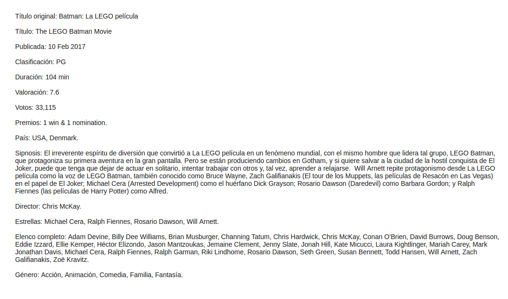

# Extensions For Grifus · Copy Movie Grifus

[Versión en español](README-ES.md)

Copy Movie Grifus añade un nuevo botón en las páginas de películas del theme Grifus con el que podrás copiar la información completa de la película con un solo click.

---

- [Requisitos](#requisitos)
- [Instalación](#instalación)
- [Imágenes](#imagenes)
- [Tests](#tests)
- [Patrocinar](#patrocinar)
- [Licencia](#licencia)

---

## Requisitos

Este módulo es soportado por versiones de **PHP 5.6** o superiores y es compatible con versiones de **HHVM 3.0** o superiores.

## Instalación

Puedes instalar este plugin desde el [repositorio oficial](https://es.wordpress.org/plugins/extensions-for-grifus/) en WordPress.

O instalar este módulo en el plugin desde [Composer](http://getcomposer.org/download/). En la carpeta raíz del plugin Extensions For Grifus ejecuta:

    composer require eliasis-framework/copy-movie-grifus

## Imágenes

## Tests

Para ejecutar las [pruebas](tests) necesitarás [Composer](http://getcomposer.org/download/) y seguir los siguientes pasos:

    git clone https://github.com/eliasis-framework/copy-movie-grifus.git
    
    cd copy-movie-grifus

    composer install

Ejecutar pruebas de estándares de código para [WordPress](https://github.com/WordPress-Coding-Standards/WordPress-Coding-Standards/) con [PHPCS](https://github.com/squizlabs/PHP_CodeSniffer):

    composer phpcs

Ejecutar pruebas con [PHP Mess Detector](https://phpmd.org/) para detectar inconsistencias en el estilo de codificación:

    composer phpmd

Ejecutar todas las pruebas anteriores:

    composer tests

[PHPUnit](https://phpunit.de/): Las pruebas unitarias para esta módulo serán realizadas en el repositorio del [plugin](https://github.com/Josantonius/extensions-for-grifus#tests).

## Patrocinar

Si este proyecto te ayuda a reducir el tiempo de desarrollo,
[puedes patrocinarme](https://github.com/josantonius/lang/es-ES/README.md#patrocinar)
para apoyar mi trabajo :blush:

## Licencia

Este repositorio tiene una licencia [GPL-2.0 License](LICENSE).

Copyright © XXXX, [Josantonius](https://github.com/josantonius/lang/es-ES/README.md#contacto)
