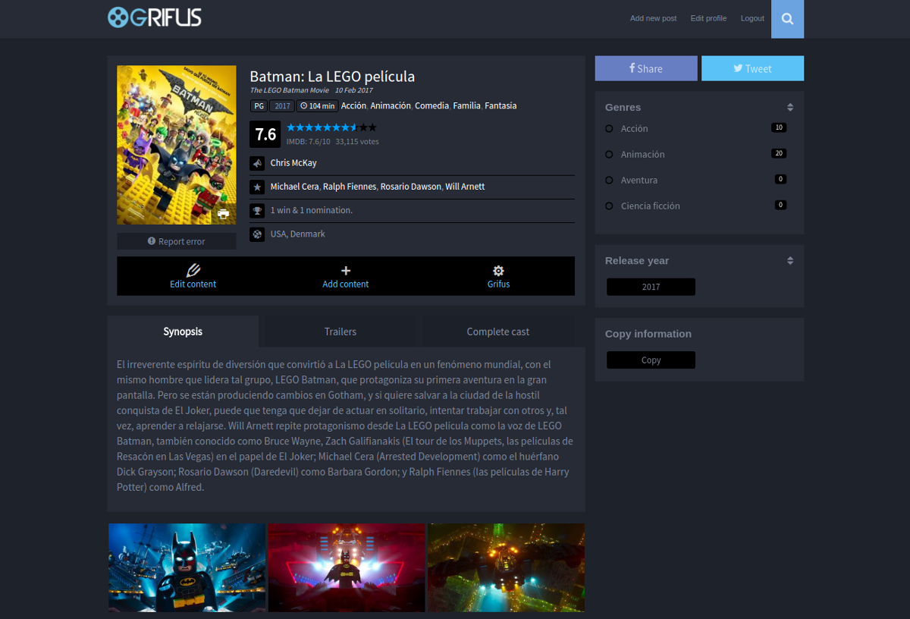
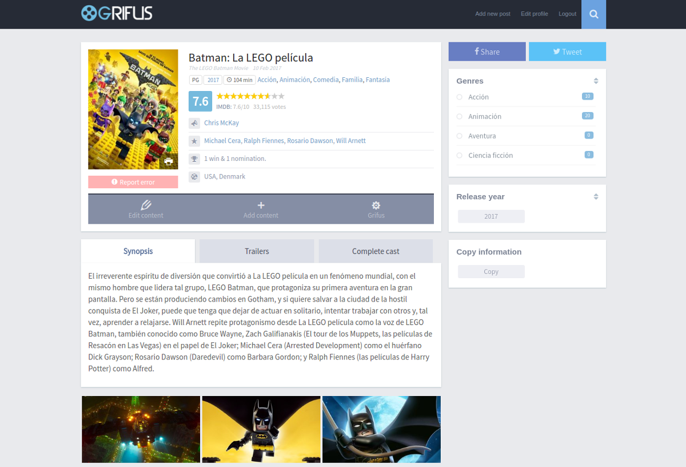
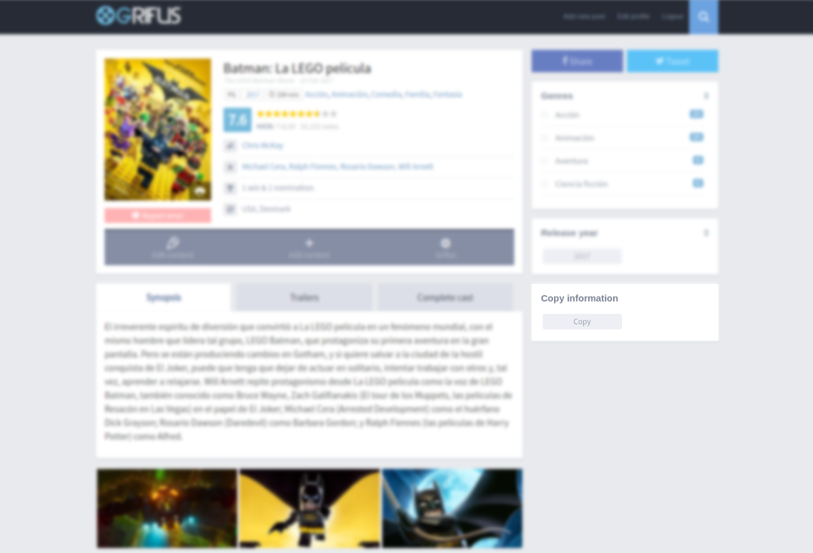

# Extensions For Grifus · Copy Movie Grifus

       

[Versión en español](README-ES.md)

Copy Movie Grifus add a new button in the film pages of the Grifus theme with which you can copy the complete information with a single click.

---

- [Requirements](#requirements)
- [Installation](#installation)
- [Images](#images)
- [Tests](#tests)
- [TODO](#-todo)
- [Contribute](#contribute)
- [License](#license)
- [Copyright](#copyright)

---

## Requirements

This module is supported by **PHP versions 5.6** or higher and is compatible with **HHVM versions 3.0** or higher.

## Installation

You can download the full plugin from the [official repository](https://es.wordpress.org/plugins/extensions-for-grifus/) in WordPress.

Or install plugin module from [Composer](http://getcomposer.org/download/). In the root folder of Extensions For Grifus plugin run:

    $ composer require eliasis-framework/copy-movie-grifus

## Images

## Tests 

To run [tests](tests) you just need [composer](http://getcomposer.org/download/) and to execute the following:

    $ git clone https://github.com/eliasis-framework/copy-movie-grifus.git
    
    $ cd copy-movie-grifus

    $ composer install

Run [WordPress](https://github.com/WordPress-Coding-Standards/WordPress-Coding-Standards/) code standard tests with [PHPCS](https://github.com/squizlabs/PHP_CodeSniffer):

    $ composer phpcs

Run [PHP Mess Detector](https://phpmd.org/) tests to detect inconsistencies in code style:

    $ composer phpmd

Run all previous tests:

    $ composer tests

[PHPUnit](https://phpunit.de/): Unit tests for this module will be performed in the [plugin](https://github.com/Josantonius/extensions-for-grifus#tests) repository.

## ☑ TODO

- [ ] Add new feature.
- [ ] Improve documentation.
- [ ] Refactor code for disabled code style rules. See [phpmd.xml](phpmd.xml) and [.php_cs.dist](.php_cs.dist).

## Contribute

If you would like to help, please take a look at the list of
[issues](https://github.com/eliasis-framework/copy-movie-grifus/issues) or the [To Do](#-todo) checklist.

**Pull requests**

* [Fork and clone](https://help.github.com/articles/fork-a-repo).
* Run the command `composer install` to install the dependencies.
  This will also install the [dev dependencies](https://getcomposer.org/doc/03-cli.md#install).
* Run the command `composer fix` to excute code standard fixers.
* Run the [tests](#tests).
* Create a **branch**, **commit**, **push** and send me a
  [pull request](https://help.github.com/articles/using-pull-requests).

## License

This project is licensed under **GPL-2.0+ license**. See the [LICENSE](LICENSE) file for more info.

## Copyright

2017 - 2018 Josantonius, [josantonius.com](https://josantonius.com/)

If you find it useful, let me know :wink:

You can contact me on [Twitter](https://twitter.com/Josantonius) or through my [email](mailto:hello@josantonius.com).